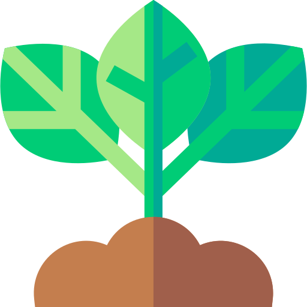

<h1 align="center">Fasal-Mitra App</h1>

</a>
 

## 📝 Table of Contents

- [About](#about)
- [Getting Started ](#getting_started)
- [Built Using](#built_using)
- [Packages](#packages)
- [Authors](#authors)
- [Contribution](#contribution)

## 🧠About 

<b>Fasal-Mitra</b> is a Progrssive Web APP (PWA) designed for automated plant disease detection and proposal of method for the prevention and cure of the disease.

- This app will help farmers to detect the diseases and how can they overcome it. 

- It will generate a detail report which will contain the disease names in number of species.

- If required, they can also verify it by the government authorities who will verify the report generated and will help with the input if required.

- The collected data will help our system to predict the diseases in more accurate way due to self-learning mechanism.

- The system will be easy to use with some basics functionalities which will make it user friendly for farmers.

 

## 1.1 Problem Definition

To develop an **App-Based solution** to identify & solve disease in plants/crops and also provide additional features such as teleconsulting to help farmers to overcome the difficulties in farming thus increasing the economic yeild.

## 1.2 Scope of the Project

The project outcome is a **Progressive Web Application** that will provide a **platform to the farmers, to monitor their plants health and provide appropriate insights  and alerts regarding crop diseases**. In addition to these primary features it should also teleconsulting features.

## 1.3 Features of the Project
1. 'Fasal Mitra', a fully responsive and automated plant disease detection Progressive Web Application (PWA)
2. Farmers need to upload a photo of the suspected diseased crop to our servers. A detailed report will be generated which will detect the presence of crop disease, predict the type of disease, and will also provide solutions for the same.
3. If required, farmers can verify the disease report from experts using our app's Teleconsulting feature.
4. Text to speech feature for farmers.
5. The collected data will help our system detect and predict plant/crop diseases with increasing accuracy by way of its self-learning and continuous improvement mechanism.

The key features of the project are: 
          (i) Language selection option (Indian regional languages)
          (ii) Tracking of IP addresses to detect possible outbreaks and issuing alerts for the same
          (iii) Prediction of upcoming outbreaks (over time, via self-learning)
          (iv) A statistics dashboard with analytics
          (v) A community forum for farmers
          (vi) A chatbot for personal communication (alerts, updates, etc.)

## 1.4 System Architecture

The system architecture for the application is as followed:

</a>

## 1.4 Activity Diagram

The activity diagram for the application is as followed:

</a>

## 1.5 Tech-Stack Used

| Packages  | Versions |
| ------------- |:-------------:|
| @craco/craco      | 6.4.0 |
| @headlessui/react     | 1.4.1 |

## 🏁 Getting Started 

These instructions will get you a copy of the project up and running on your local machine for development and testing purposes.

### Prerequisites

- [Modern Web Architecture](https://litslink.com/blog/web-application-architecture) 
- [Web API's](https://www.geeksforgeeks.org/what-is-web-api-and-why-we-use-it/)
- [Frontend](https://en.wikipedia.org/wiki/Front-end_web_development)
   - [React](https://reactjs.org/)
- [Backend](https://en.wikibooks.org/wiki/Web_Development/What_is_a_backend%3F)
   - [Node](https://nodejs.org/)
   - [Flask](https://flask.palletsprojects.com/en/2.1.x/)
- [Database](https://www.techtarget.com/searchdatamanagement/definition/database#:~:text=A%20database%20is%20information%20that,data%2C%20financials%20and%20product%20information.)
   - [MongoDB](https://www.mongodb.com/)
- [Containerization](https://www.ibm.com/in-en/cloud/learn/containerization)
   - [Docker](https://www.docker.com/)

### Installing

A step by step series of examples that tell you how to get a development env running.

- Clone this repository
- Open command line in the cloned folder,

  - To install dependencies, run `npm install`

  - To run the application for development,

    - then run `npm start` in the client folder to start the app

- Open [localhost:3000](localhost:3000) in the browser

or else it can also be executed by using `docker-compose up` respectively with the frontend and the backend.

## :hammer_and_wrench: Built Using 

- [React](https://reactjs.org/) - Web Framework
- [Tailwind CSS](https://tailwindcss.com/) - CSS Framework
- [Redux](https://github.com/DomParfitt/graphviz-react#readme) - Library for visualization of the DFA
- [MaterialUI](https://quickchart.io/documentation/graphviz-api/) - API for visualization

## 📦 Packages Used 

 
| Packages  | Versions |
| ------------- |:-------------:|
| @craco/craco      | 6.4.0 |
| @headlessui/react     | 1.4.1 |
| @heroicons/react      | 1.0.5    |
|@hookform/resolvers|2.8.3|
|autoprefixer| 9.8.8|
|axios|0.23.0|
|bootstrap|5.1.3|
|cra-template|1.1.2|
|gh-pages|3.2.3|
|postcss|7.0.39|
|react|17.0.2|
|react-bootstrap|2.0.0|
|react-dom|17.0.2|
|react-fullscreen-image|0.0.3|
|react-hook-form|7.19.3|
|react-icons|4.3.1|
|react-router-dom|5.3.0|
|react-scripts|4.0.3|
|npm:@tailwindcss/postcss7-compat|2.2.17|
|svg-to-jsx|1.0.4|
|yup|0.32.11|
 

## :pencil2: Authors 

- [Ishan Kulkarni](https://www.linkedin.com/in/anurag-g-a01531198)
- [Anurag Ghosh](https://www.linkedin.com/in/kulkarniishan)
- [Dhruv Solanki](#)
- [Rajas Bondale](#)
- [Aditi Pawar](#)

## :brain: Contribution over Time 

 

